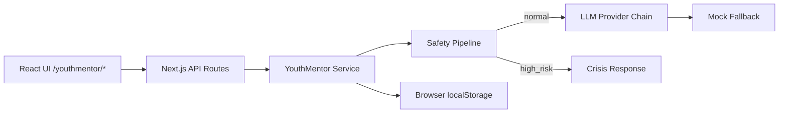
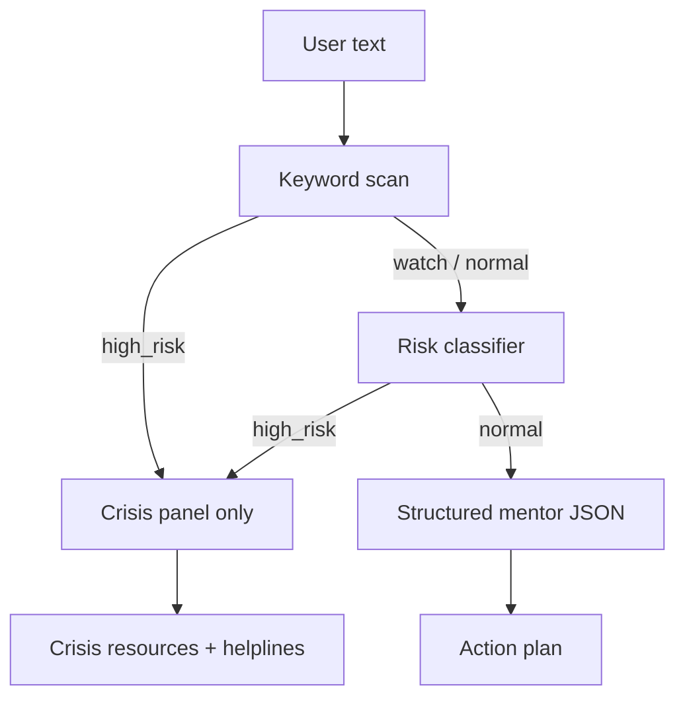
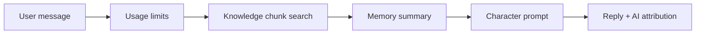

# YouthMentor AI — Architecture

## System overview

## Safety pipeline

**Design principle:** Never rely on LLM alone for safety. Keyword layer runs first; high-risk blocks before any coaching prompt.

## AI provider layer

Uses shared `EDULENS_*` environment variables for LLM configuration:

| Mode | Behavior |
|------|----------|
| `mock` | Seeded demo responses — no external API |
| `auto` | Provider chain: Groq → Gemini → OpenRouter → … |
| `gemini` / `groq` | Single provider |

Configured via Vercel environment variables (never in git).

## Character chat

## Deployment

| Component | Location |
|-----------|----------|
| Source (private) | `mentorkokkwa/leo-suite-growth` |
| Vercel project | `leo-suite-growth` @ vercel.com/cenzhi |
| Public docs | `mentorkokkwa/leo-suite-growth-showcase` |

Root directory: `.` (repo root is the Next.js app).

## Data & privacy

| Data | Storage | Server DB |
|------|---------|-----------|
| Reflections, mood | `localStorage` | None |
| Character memory | `localStorage` | None |
| LLM requests | Transient API call | Not persisted |

## Tech stack

- Next.js 16 (App Router)
- React 19, TypeScript
- Tailwind CSS 4
- Multi-provider LLM abstraction
